```python
import numpy as np
import yfinance as yf
import seaborn as sns
from datetime import datetime
import matplotlib.pyplot as plt
import pandas as pd
```

# Set up


```python
START = "2023-01-01"
END = "2025-01-01"
TICKER = "^GSPC"
TITLE = TICKER + " - " +(datetime.now()).strftime("%Y-%m-%d - %H:%M:%S")
```


```python
data = pd.read_csv("data.csv")

data["log_return"] = np.log(data["Close"] / data["Close"].shift(1))

data.dropna(inplace=True)
```


```python
fig = plt.figure(figsize=(15,4))
sns.lineplot(data["log_return"].cumsum()).set_title(TITLE)
plt.show()
```


    
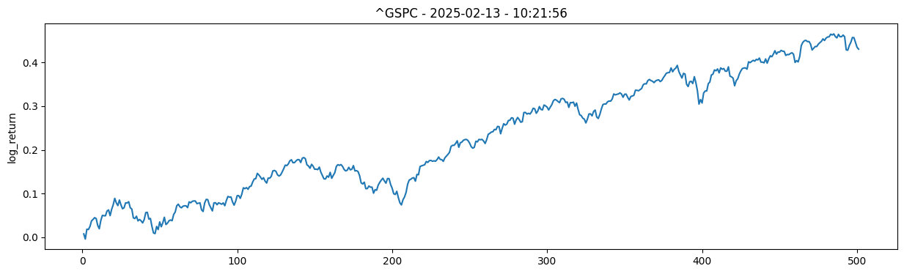
    


```python
fig = plt.figure(figsize=(15,4))
sns.histplot(data["log_return"]).set_title(TITLE)
plt.show()
```


    
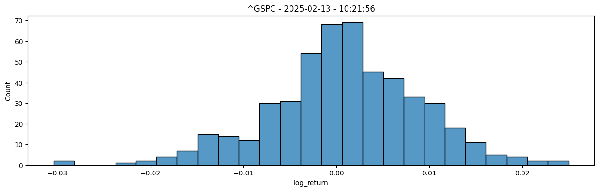
    


## SMA


```python
def sma(data, t):
    return data.shift(1).rolling(t).mean()
```


```python
Fast = 20
Slow = 50
Long = 200
data["SMA_fast"] = sma(data["Close"],Fast)
data["SMA_slow"] = sma(data["Close"],Slow)
data["SMA_long"] = sma(data["Close"],Long)
```


```python
fig = plt.figure(figsize=(15,4))
ax1 = sns.lineplot(data["Close"],label="Close")
ax2 = sns.lineplot(data["SMA_fast"],label=f"{Fast=}")
ax3 = sns.lineplot(data["SMA_slow"],label=f"{Slow=}")
ax1.set_title(TITLE)
plt.legend()
plt.show()
```


    
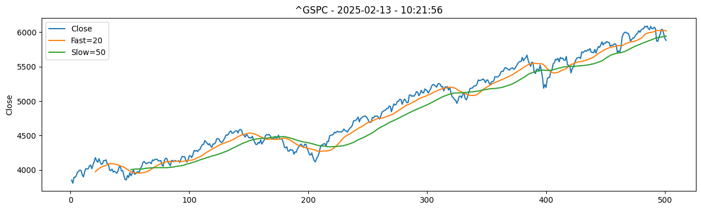
    


```python
data["bull"] = data["SMA_fast"] > data["SMA_slow"]
```


```python
fig = plt.figure(figsize=(15,4))
plt.fill_between(data.index, data["Close"], 0, where=data["bull"],color="green",alpha=0.5,interpolate=True)
plt.fill_between(data.index, data["Close"], 0, where=~data["bull"],color="red",alpha=0.5,interpolate=True)
plt.fill_between(data.index, data["Close"], data["SMA_long"],color="grey",alpha=0.5,interpolate=True)
ax1 = sns.lineplot(data["Close"], label="Close")
ax1 = sns.lineplot(data["SMA_long"], label=f"{Long=}")
ax1.set_title(TITLE)
plt.show()
```


    
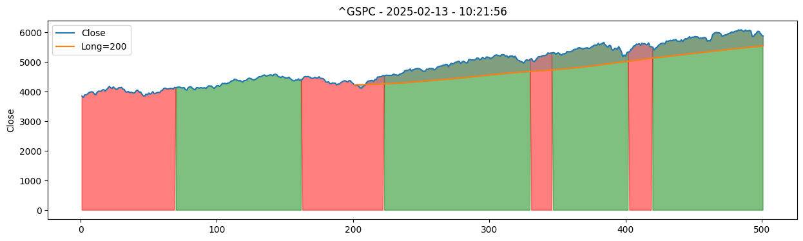
    


# Bull and bear markets


```python
sns.histplot(data["log_return"],alpha=0.3).set_title(TITLE)
```


    Text(0.5, 1.0, '^GSPC - 2025-02-13 - 10:21:56')


    
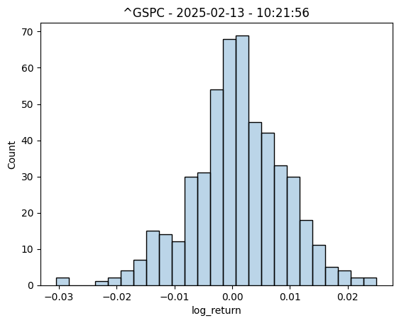
    


```python
sns.histplot(data["log_return"].where(data["bull"]),color="green",alpha=0.3).set_title(TITLE)
```


    Text(0.5, 1.0, '^GSPC - 2025-02-13 - 10:21:56')


    
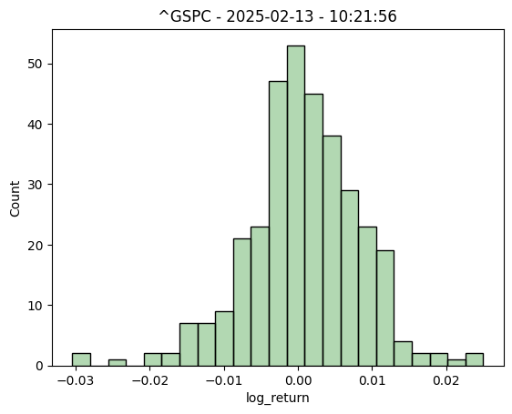
    


```python
sns.histplot(data["log_return"].where(~data["bull"]),color="red",alpha=0.3).set_title(TITLE)
```


    Text(0.5, 1.0, '^GSPC - 2025-02-13 - 10:21:56')


    
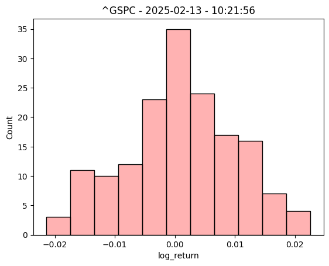
    


```python
sns.histplot(data["log_return"],alpha=0.3).set_title(TITLE)
sns.histplot(data["log_return"].where(data["bull"]),color="green",alpha=0.3).set_title(TITLE)
sns.histplot(data["log_return"].where(~data["bull"]),color="red",alpha=0.3).set_title(TITLE)
```


    Text(0.5, 1.0, '^GSPC - 2025-02-13 - 10:21:56')


    
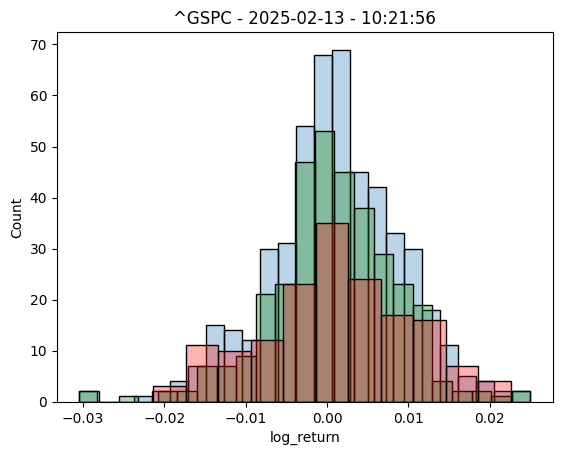
    


# 1 - Descriptive statistics


```python
from scipy import stats
```


```python
def jarque_bera(data):
    # Reject Null if 0.05>
    return stats.jarque_bera(data.dropna()).pvalue


def describe_returns(data):
    mean = data.mean()
    std = data.std()
    skew = data.skew()
    kurt = data.kurt()
    jarque = jarque_bera(data)

    return pd.DataFrame({"Mean %" : [mean], "Standard deviation %": [std], "Skew": [skew], "Kurtosis": [kurt], "Jarque-bera p value":[jarque]})
```


```python
both = describe_returns(data['log_return'])
bull = describe_returns(data['log_return'].where(data['bull']))
bear = describe_returns(data['log_return'].where(~data['bull']))
```


```python
combined = pd.concat([both,bull,bear])
combined.index = ["Both", "Bull", "Bear"]
combined["Mean %"] *= 100
combined["Standard deviation %"] *= 100

round(combined.T,4)
```


<div>
<style scoped>
    .dataframe tbody tr th:only-of-type {
        vertical-align: middle;
    }

    .dataframe tbody tr th {
        vertical-align: top;
    }

    .dataframe thead th {
        text-align: right;
    }
</style>
<table border="1" class="dataframe">
  <thead>
    <tr style="text-align: right;">
      <th></th>
      <th>Both</th>
      <th>Bull</th>
      <th>Bear</th>
    </tr>
  </thead>
  <tbody>
    <tr>
      <th>Mean %</th>
      <td>0.0859</td>
      <td>0.0724</td>
      <td>0.1141</td>
    </tr>
    <tr>
      <th>Standard deviation %</th>
      <td>0.8108</td>
      <td>0.7567</td>
      <td>0.9156</td>
    </tr>
    <tr>
      <th>Skew</th>
      <td>-0.2853</td>
      <td>-0.4006</td>
      <td>-0.1720</td>
    </tr>
    <tr>
      <th>Kurtosis</th>
      <td>0.7527</td>
      <td>1.6462</td>
      <td>-0.3532</td>
    </tr>
    <tr>
      <th>Jarque-bera p value</th>
      <td>0.0001</td>
      <td>0.0000</td>
      <td>0.4158</td>
    </tr>
  </tbody>
</table>
</div>


# Students t-test on Bull and bear markets

This is a test for the null hypothesis that 2 independent samples have identical average (expected) values. **This test assumes that the populations have identical variances by default.**

The p-value quantifies the probability of observing as or more extreme values assuming the null hypothesis, that the samples are drawn from populations with the same population means, is true. A p-value larger than a chosen threshold (e.g. 5% or 1%) indicates that our observation is not so unlikely to have occurred by chance. Therefore, we do not reject the null hypothesis of equal population means. If the p-value is smaller than our threshold, then we have evidence against the null hypothesis of equal population means.

ttest_ind underestimates p for unequal variances:


```python
stats.ttest_ind(data["log_return"],data["log_return"].where(data["bull"]),nan_policy="omit").pvalue
```


    np.float64(0.8081878403710501)


0.8>0.05 - Accept null 


```python
stats.ttest_ind(data["log_return"],data["log_return"].where(~data["bull"]),nan_policy="omit").pvalue
```


    np.float64(0.709493872061443)


0.71 > 0.05 - Accept null

# Type errors


```python
true_positive = (data["bull"] & (data["log_return"] > 0)).value_counts().iloc[1]
true_negative = (~data["bull"] & (data["log_return"] < 0)).value_counts().iloc[1]

false_postive = (data["bull"] & (data["log_return"] < 0)).value_counts().iloc[1]
false_negative = (~data["bull"] & (data["log_return"] > 0)).value_counts().iloc[1]
```

# Precision

TP + (TP + FP)


```python
true_positive / (true_positive + false_postive)
```


    np.float64(0.5545722713864307)


# Accuracy

(TP + TN) / all


```python
(true_positive + true_negative) / (true_positive + true_negative + false_negative + false_postive)
```


    np.float64(0.5149700598802395)


## Balanced accuracy


```python
TPR = true_positive / (true_positive + false_negative)
TNR = true_negative / (true_negative + false_postive)

(TPR + TNR) / 2
```


    np.float64(0.4940853264382676)


# Recall


```python
true_positive / (true_positive + false_negative)
```


    np.float64(0.6714285714285714)


# F1 score


```python
(2*true_positive) / (2*(true_positive + false_postive + false_negative))
```


    np.float64(0.4361948955916473)


# Back testing


```python
last = 0
# [Date, Buy, Balance, Position]
equity = [(data.index[0],0,10_000,0)]
for index, row in data.iterrows():

    buy = 0
    position = equity[-1][3]
    balance = equity[-1][2]
    if row["bull"] and not last: # Buy
        buy = 1
        position = balance // row["Open"]
        balance -= row["Open"] * position

    if not row["bull"] and last: # Sell
        buy = -1
        balance += row["Open"] * position
        position = 0

    equity.append((index, buy, balance, position))
    last = row["bull"]

equity = pd.DataFrame(equity,columns=["Date","buy","balance","position"])

equity = equity.set_index("Date")

data = data.join(equity)

data["value"] = (data["position"] * data["Close"]) + data["balance"]
```


```python
fig, ax1 = plt.subplots(figsize=(15,4))

plt.fill_between(data.index, data["Close"], 0, where=data["bull"],color="green",alpha=0.5,interpolate=True)
plt.fill_between(data.index, data["Close"], 0, where=~data["bull"],color="red",alpha=0.5,interpolate=True)
plt.fill_between(data.index, data["Close"], data["SMA_long"],color="grey",alpha=0.5,interpolate=True)

ax1 = sns.lineplot(data["Close"],color="grey",alpha=0.5, label="price")
ax1 = sns.lineplot(data["SMA_long"],label=f"{Long=}")
ax1 = sns.lineplot(data["SMA_fast"], label=f"{Fast=}")
ax1 = sns.lineplot(data["SMA_slow"], label=f"{Slow=}")
# sns.lineplot(data["value"])

df_filt = data[data["buy"] != 0.0]

for index, value in df_filt.iterrows():
    if value["buy"] == -1.0:
        ax1.annotate("▼",(index,value["Close"]), color="red",fontsize=20)
    if value["buy"] == 1.0:
        ax1.annotate("▲",(index,value["Close"]), color="green",fontsize=20)

fig.tight_layout()
ax1.set_title(TITLE)
plt.show()
```


    
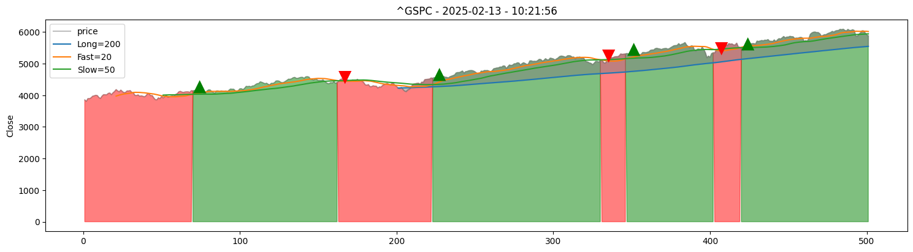
    


```python
# data.to_excel("test.xlsx")
```


```python
data["log_return"].sum()
```


    np.float64(0.43801103170967715)


```python
data["value_log_return"] = np.log((data["value"] / data["value"].shift(1)))

data["value_log_return"].sum()
```


    np.float64(0.22729803448569985)


```python
fig, ax1 = plt.subplots(figsize=(15,4))
sns.lineplot(data["value_log_return"].cumsum(),dashes=False,label="SMA",color="red").set_title(TITLE)
sns.lineplot(data["log_return"].cumsum(),dashes=False,label=TICKER,alpha=0.5,color="grey",zorder=0)
```


    <Axes: title={'center': '^GSPC - 2025-02-13 - 10:21:56'}, ylabel='value_log_return'>


    
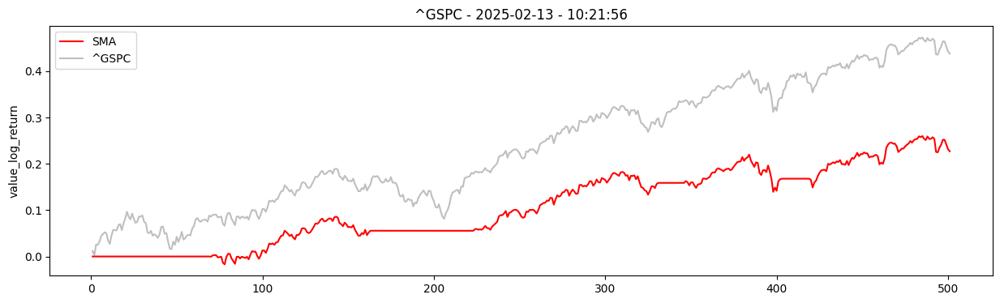
    


# Drawdown


```python
fig, ax1 = plt.subplots(figsize=(15,4))
sns.lineplot(data["value_log_return"].cumsum() - data["value_log_return"].cumsum().cummax(),dashes=False,label="SMA",color="red").set_title(TITLE)
sns.lineplot(data["log_return"].cumsum() - data["log_return"].cumsum().cummax(),dashes=False,label=TICKER, alpha=0.5,color="grey",zorder=0)
```


    <Axes: title={'center': '^GSPC - 2025-02-13 - 10:21:56'}, ylabel='value_log_return'>


    
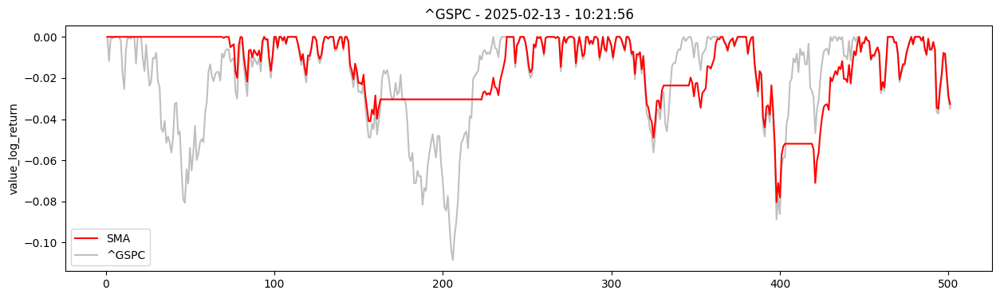
    


# Portfolio stats (annual)


```python
data["log_return"].sum() / 5
```


    np.float64(0.08760220634193543)


```python
data["value_log_return"].sum() / 5
```


    np.float64(0.04545960689713997)


```python
data["log_return"].std() * np.sqrt(252*5)
```


    np.float64(0.2877027298666383)


```python
data["value_log_return"].std() * np.sqrt(252*5)
```


    np.float64(0.19620880942660335)


```python
((data["log_return"].mean()) / (data["log_return"].std())) * np.sqrt(252)
```


    np.float64(1.7089245619860631)


```python
(data["value_log_return"].mean() / data["value_log_return"].std()) * np.sqrt(252)
```


    np.float64(1.3029417334047433)


